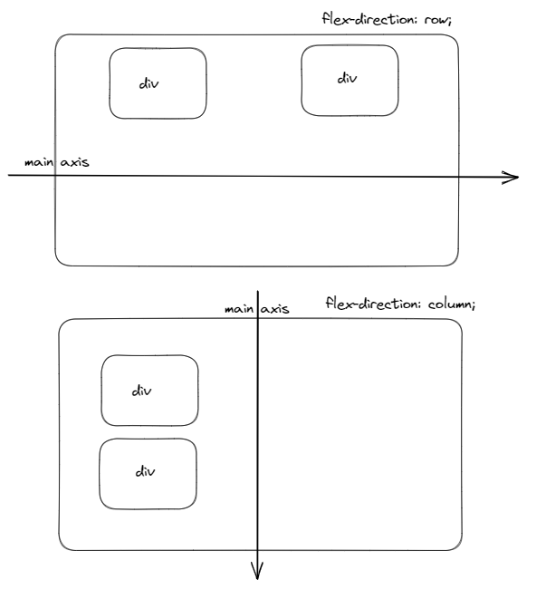
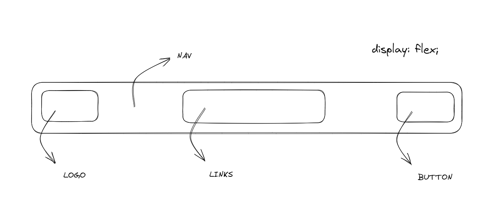
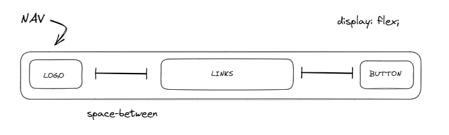

# FLEXBOX

Em HTML, tudo é uma caixa.

- `display`:
    - `block`: próximo elemento fique abaixo. Ocupa a linha inteira.
    - `inline`: tamanho do elemento seja o tamanho do conteúdo, próximo item fica ao lado.
    - `flex`: alinhar atributos e distribuir espaços dentro do container.

## Flex Parent Container

1. `flex-direction` (row | row-reverse | column | column-reverse)
2. `flex-wrap` (nowrap | wrap | wrap-reverse)
3. `flex-flow` (column wrap)
4. `justify-content` (flex-start | flex-end | center | space-between | space-around | space-evenly | start | end | left | right ... + safe | unsafe)
5. `align-items` (stretch | flex-start | flex-end | center | baseline | first baseline | last baseline | start | end | self-start | self-end + ... safe | unsafe)
6. `align-content` (flex-start | flex-end | center | space-between | space-around | space-evenly | stretch | start | end | baseline | first baseline | last baseline + ... safe | unsafe)
7. `gap` (px)
8. `row-gap` (px)
9. `column-gap` (px)

## Flex Children item

1. `order` (number)
2. `flex-grow` (number)
3. `flex-shrink` (number)
4. `flex-basis` (auto)
5. `flex` (none | [ <'flex-grow'> <'flex-shrink'>? || <'flex-basis'> ])
6. `align-self` (auto | flex-start | flex-end | center | baseline | stretch)

### Alguns rascunhos

1. Directions

2. Nav example

